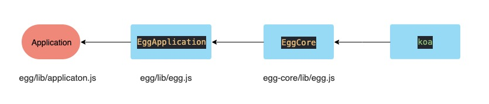
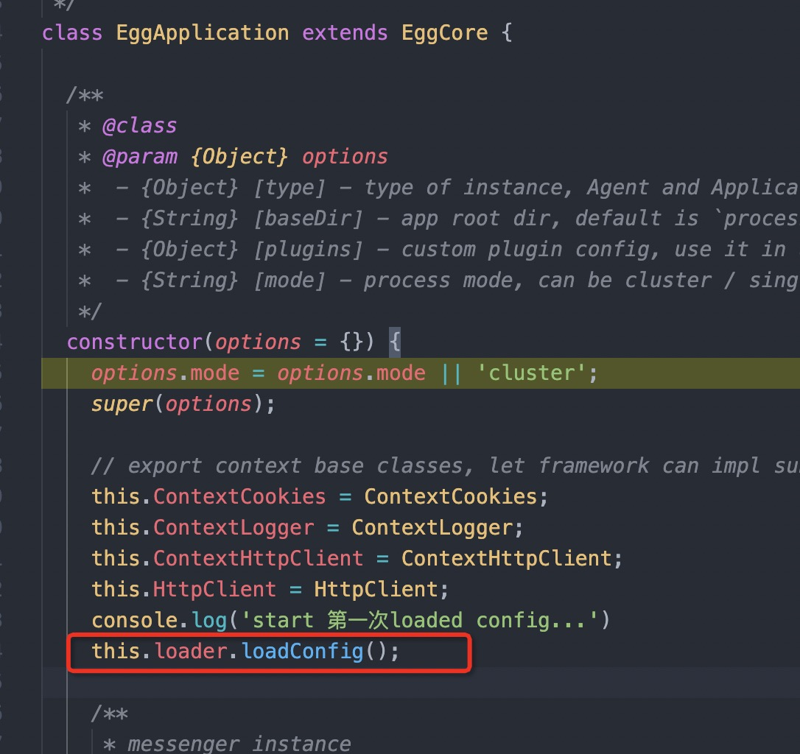

我们知道egg是继承于koa；通过梳理源码我们发现其具体的继承关系如下：



Application 先继承 EggApplication， EggApplication 又继承 EggCore；
最后EggCore 继承 koa；所以我们从基类EggCore的构造函数开始进行分析(因为new Application 会从继类开始的构造函数开始执行)。

## EggCore

```js
class EggCore extends KoaApplication {
  constructor(options = {}) {
    options.baseDir = options.baseDir || process.cwd();
    options.type = options.type || 'application';

    super();

    this.timing = new Timing();
    this[DEPRECATE] = new Map();
    this._options = this.options = options;
    this.deprecate.property(this, '_options', 'app._options is deprecated, use app.options instead');

    this.console = new EggConsoleLogger();

    this.BaseContextClass = BaseContextClass;

    const Controller = this.BaseContextClass;

    this.Controller = Controller;

    const Service = this.BaseContextClass;

    this.Service = Service;

    this.lifecycle = new Lifecycle({
      baseDir: options.baseDir,
      app: this,
      logger: this.console,
    });
    this.lifecycle.on('error', err => this.emit('error', err));
    this.lifecycle.on('ready_timeout', id => this.emit('ready_timeout', id));
    this.lifecycle.on('ready_stat', data => this.emit('ready_stat', data));

    const Loader = this[EGG_LOADER];
    this.loader = new Loader({
      baseDir: options.baseDir,
      app: this,
      plugins: options.plugins,
      logger: this.console,
      serverScope: options.serverScope,
      env: options.env,
    });
  }

  use(fn) {
    assert(is.function(fn), 'app.use() requires a function');
    debug('use %s', fn._name || fn.name || '-');
    this.middleware.push(utils.middleware(fn));
    return this;
  }

  get type() {
    return this.options.type;
  }

  get baseDir() {
    return this.options.baseDir;
  }

  get deprecate() {
    const caller = utils.getCalleeFromStack();
    if (!this[DEPRECATE].has(caller)) {
      const deprecate = require('depd')('egg');
      // dynamic set _file to caller
      deprecate._file = caller;
      this[DEPRECATE].set(caller, deprecate);
    }
    return this[DEPRECATE].get(caller);
  }

  get name() {
    return this.loader ? this.loader.pkg.name : '';
  }

  get plugins() {
    return this.loader ? this.loader.plugins : {};
  }

  get config() {
    return this.loader ? this.loader.config : {};
  }

  beforeStart(scope) {
    this.lifecycle.registerBeforeStart(scope);
  }

  ready(flagOrFunction) {
    return this.lifecycle.ready(flagOrFunction);
  }

  readyCallback(name, opts) {
    return this.lifecycle.legacyReadyCallback(name, opts);
  }

  beforeClose(fn) {
    this.lifecycle.registerBeforeClose(fn);
  }

  async close() {
    if (this[CLOSE_PROMISE]) return this[CLOSE_PROMISE];
    this[CLOSE_PROMISE] = this.lifecycle.close();
    return this[CLOSE_PROMISE];
  }

  get router() {
    if (this[ROUTER]) {
      return this[ROUTER];
    }
    const router = this[ROUTER] = new Router({ sensitive: true }, this);
    // register router middleware
    this.beforeStart(() => {
      this.use(router.middleware());
    });
    return router;
  }

  url(name, params) {
    return this.router.url(name, params);
  }

  del(...args) {
    this.router.delete(...args);
    return this;
  }

  get [EGG_LOADER]() {
    return require('./loader/egg_loader');
  }

  toAsyncFunction(fn) {
    if (!is.generatorFunction(fn)) return fn;
    fn = co.wrap(fn);
    return async function(...args) {
      return fn.apply(this, args);
    };
  }

  toPromise(obj) {
    return co(function* () {
      return yield obj;
    });
  }
}
```

从上面代码中可知，构造函数初始化了很多基础的属性，其中有两个属性非常重要：

1. this.lifecycle 负责整个eggjs 实例的生命周期，在后续会深入分析整个生命周期；
2. this.loader = new Loader({options}); 解决了eggjs 为什么在服务启动后，会自动加载，将项目路径下的router.js, controller/**.js, 以及service/**.js绑定到 app 实例上， 我们接下来会重点分析这个loader.

## EggApplication(egg/lib/egg.js)

```js
class EggApplication extends EggCore {

  constructor(options = {}) {
    options.mode = options.mode || 'cluster';
    super(options);

    // export context base classes, let framework can impl sub class and over context extend easily.
    this.ContextCookies = ContextCookies;
    this.ContextLogger = ContextLogger;
    this.ContextHttpClient = ContextHttpClient;
    this.HttpClient = HttpClient;
    this.loader.loadConfig();

    this.messenger = Messenger.create(this);

    this.messenger.once('egg-ready', () => {
      this.lifecycle.triggerServerDidReady();
    });
    this.ready(() => process.nextTick(() => {
      const dumpStartTime = Date.now();
      this.dumpConfig();
      this.dumpTiming();
      this.coreLogger.info('[egg:core] dump config after ready, %s', ms(Date.now() - dumpStartTime));
    }));
    this._setupTimeoutTimer();

    this.console.info('[egg:core] App root: %s', this.baseDir);
    this.console.info('[egg:core] All *.log files save on %j', this.config.logger.dir);
    this.console.info('[egg:core] Loaded enabled plugin %j', this.loader.orderPlugins);

    // Listen the error that promise had not catch, then log it in common-error
    this._unhandledRejectionHandler = this._unhandledRejectionHandler.bind(this);
    process.on('unhandledRejection', this._unhandledRejectionHandler);

    this[CLUSTER_CLIENTS] = [];

    this.cluster = (clientClass, options) => {
      options = Object.assign({}, this.config.clusterClient, options, {
        singleMode: this.options.mode === 'single',
        // cluster need a port that can't conflict on the environment
        port: this.options.clusterPort,
        // agent worker is leader, app workers are follower
        isLeader: this.type === 'agent',
        logger: this.coreLogger,
      });
      const client = cluster(clientClass, options);
      this._patchClusterClient(client);
      return client;
    };

    // register close function
    this.beforeClose(async () => {
      // single process mode will close agent before app close
      if (this.type === 'application' && this.options.mode === 'single') {
        await this.agent.close();
      }

      for (const logger of this.loggers.values()) {
        logger.close();
      }
      this.messenger.close();
      process.removeListener('unhandledRejection', this._unhandledRejectionHandler);
    });

    this.BaseContextClass = BaseContextClass;

    this.Controller = BaseContextClass;

    this.Service = BaseContextClass;

    this.Subscription = BaseContextClass;

    this.BaseHookClass = BaseHookClass;

    this.Boot = BaseHookClass;
  }

  inspect() {
    const res = {
      env: this.config.env,
    };

    function delegate(res, app, keys) {
      for (const key of keys) {
        /* istanbul ignore else */
        if (app[key]) {
          res[key] = app[key];
        }
      }
    }

    function abbr(res, app, keys) {
      for (const key of keys) {
        /* istanbul ignore else */
        if (app[key]) {
          res[key] = `<egg ${key}>`;
        }
      }
    }

    delegate(res, this, [
      'name',
      'baseDir',
      'subdomainOffset',
    ]);

    abbr(res, this, [
      'config',
      'controller',
      'httpclient',
      'loggers',
      'middlewares',
      'router',
      'serviceClasses',
    ]);

    return res;
  }

  toJSON() {
    return this.inspect();
  }

  curl(url, opts) {
    return this.httpclient.request(url, opts);
  }

  get httpclient() {
    if (!this[HTTPCLIENT]) {
      if (this.config.httpclient.enableDNSCache) {
        this[HTTPCLIENT] = new DNSCacheHttpClient(this);
      } else {
        this[HTTPCLIENT] = new this.HttpClient(this);
      }
    }
    return this[HTTPCLIENT];
  }

  get loggers() {
    if (!this[LOGGERS]) {
      this[LOGGERS] = createLoggers(this);
    }
    return this[LOGGERS];
  }

  getLogger(name) {
    return this.loggers[name] || null;
  }

  get logger() {
    return this.getLogger('logger');
  }

  get coreLogger() {
    return this.getLogger('coreLogger');
  }

  _unhandledRejectionHandler(err) {
    if (!(err instanceof Error)) {
      const newError = new Error(String(err));
      // err maybe an object, try to copy the name, message and stack to the new error instance
      /* istanbul ignore else */
      if (err) {
        if (err.name) newError.name = err.name;
        if (err.message) newError.message = err.message;
        if (err.stack) newError.stack = err.stack;
      }
      err = newError;
    }
    /* istanbul ignore else */
    if (err.name === 'Error') {
      err.name = 'unhandledRejectionError';
    }
    this.coreLogger.error(err);
  }

  dumpConfigToObject() {
    let ignoreList;
    try {
      // support array and set
      ignoreList = Array.from(this.config.dump.ignore);
    } catch (_) {
      ignoreList = [];
    }

    const json = extend(true, {}, { config: this.config, plugins: this.plugins });
    utils.convertObject(json, ignoreList);
    return {
      config: json,
      meta: this.loader.configMeta,
    };
  }

  dumpConfig() {
    const rundir = this.config.rundir;
    try {
      /* istanbul ignore if */
      if (!fs.existsSync(rundir)) fs.mkdirSync(rundir);

      // get dumpped object
      const { config, meta } = this.dumpConfigToObject();

      // dump config
      const dumpFile = path.join(rundir, `${this.type}_config.json`);
      fs.writeFileSync(dumpFile, CircularJSON.stringify(config, null, 2));

      // dump config meta
      const dumpMetaFile = path.join(rundir, `${this.type}_config_meta.json`);
      fs.writeFileSync(dumpMetaFile, CircularJSON.stringify(meta, null, 2));
    } catch (err) {
      this.coreLogger.warn(`dumpConfig error: ${err.message}`);
    }
  }

  dumpTiming() {
    try {
      const json = this.timing.toJSON();
      const rundir = this.config.rundir;
      const dumpFile = path.join(rundir, `${this.type}_timing_${process.pid}.json`);
      fs.writeFileSync(dumpFile, CircularJSON.stringify(json, null, 2));
    } catch (err) {
      this.coreLogger.warn(`dumpTiming error: ${err.message}`);
    }
  }

  get [EGG_PATH]() {
    return path.join(__dirname, '..');
  }

  _setupTimeoutTimer() {
    const startTimeoutTimer = setTimeout(() => {
      this.coreLogger.error(`${this.type} still doesn't ready after ${this.config.workerStartTimeout} ms.`);
      this.emit('startTimeout');
    }, this.config.workerStartTimeout);
    this.ready(() => clearTimeout(startTimeoutTimer));
  }

  get env() {
    this.deprecate('please use app.config.env instead');
    return this.config.env;
  }
  /* eslint no-empty-function: off */
  set env(_) {}

  get proxy() {
    this.deprecate('please use app.config.proxy instead');
    return this.config.proxy;
  }
  /* eslint no-empty-function: off */
  set proxy(_) {}

  addSingleton(name, create) {
    const options = {};
    options.name = name;
    options.create = create;
    options.app = this;
    const singleton = new Singleton(options);
    const initPromise = singleton.init();
    if (initPromise) {
      this.beforeStart(async () => {
        await initPromise;
      });
    }
  }

  _patchClusterClient(client) {
    const create = client.create;
    client.create = (...args) => {
      const realClient = create.apply(client, args);
      this[CLUSTER_CLIENTS].push(realClient);
      this.beforeClose(() => cluster.close(realClient));
      return realClient;
    };
  }

  createAnonymousContext(req) {
    const request = {
      headers: {
        host: '127.0.0.1',
        'x-forwarded-for': '127.0.0.1',
      },
      query: {},
      querystring: '',
      host: '127.0.0.1',
      hostname: '127.0.0.1',
      protocol: 'http',
      secure: 'false',
      method: 'GET',
      url: '/',
      path: '/',
      socket: {
        remoteAddress: '127.0.0.1',
        remotePort: 7001,
      },
    };
    if (req) {
      for (const key in req) {
        if (key === 'headers' || key === 'query' || key === 'socket') {
          Object.assign(request[key], req[key]);
        } else {
          request[key] = req[key];
        }
      }
    }
    const response = new http.ServerResponse(request);
    return this.createContext(request, response);
  }

  createContext(req, res) {
    const app = this;
    const context = Object.create(app.context);
    const request = context.request = Object.create(app.request);
    const response = context.response = Object.create(app.response);
    context.app = request.app = response.app = app;
    context.req = request.req = response.req = req;
    context.res = request.res = response.res = res;
    request.ctx = response.ctx = context;
    request.response = response;
    response.request = request;
    context.onerror = context.onerror.bind(context);
    context.originalUrl = request.originalUrl = req.url;

    /**
     * Request start time
     * @member {Number} Context#starttime
     */
    context.starttime = Date.now();
    return context;
  }
}
```
> 这个 EggApplication 中也同样初始化了很多基础的属性，但在构造函数初始化时，有调用EggCore构造函数初始化的loader的loadConfig() 方法。方法顾名思义就是加载配置，这个方法指向 egg/lib/loader/app_worker_loader .js 的方法loadConfig，



```js
// egg/lib/loader/app_worker_loader .js

  /**
   * loadPlugin first, then loadConfig
   * @since 1.0.0
   */
  loadConfig() {
    this.loadPlugin();
    super.loadConfig();
  }
```

> this.loadPlugin() 就是加载所有的plugin， super.loadConfig会加载所有的config。

## this.loadPlugin

this.loadPlugin 的源码比较长，大体分析一下做了两件事。
1.找到所有当前环境下的plugin；
2.将plugin挂在this（this指向AppWorkerLoader)上；

```js
loadPlugin() {
    // 获取应用内的 插件文件地址 config/plugin.default
    const appPlugins = this.readPluginConfigs(path.join(this.options.baseDir, 'config/plugin.default'));

    // 获取egg框架本身的插件文件 egg/config/plugin.default
    const eggPluginConfigPaths = this.eggPaths.map(eggPath => path.join(eggPath, 'config/plugin.default'));
    const eggPlugins = this.readPluginConfigs(eggPluginConfigPaths);

    // 通过启动命令时，命令行带参数EGG_PLUGINS的插件
    let customPlugins;
    if (process.env.EGG_PLUGINS) {
      try {
        customPlugins = JSON.parse(process.env.EGG_PLUGINS);
      } catch (e) {
        debug('parse EGG_PLUGINS failed, %s', e);
      }
    }

    if (this.options.plugins) {
      customPlugins = Object.assign({}, customPlugins, this.options.plugins);
    }

    if (customPlugins) {
      for (const name in customPlugins) {
        this.normalizePluginConfig(customPlugins, name);
      }
      debug('Loaded custom plugins: %j', Object.keys(customPlugins));
    }

    this.allPlugins = {};
    this.appPlugins = appPlugins;
    this.customPlugins = customPlugins;
    this.eggPlugins = eggPlugins;
    // 将应用内的插件放在this.appPlugins
    // 将框架插件放在this.eggPlugins
    // 将命令行带过来的插件放在 this.customPlugins
    this._extendPlugins(this.allPlugins, eggPlugins);
    this._extendPlugins(this.allPlugins, appPlugins);
    this._extendPlugins(this.allPlugins, customPlugins);
    // 将框架插件，应用内插件，命令行插件合并到this.allPlugins;

    const enabledPluginNames = []; // enabled plugins that configured explicitly
    const plugins = {};
    const env = this.serverEnv;

    for (const name in this.allPlugins) {
      const plugin = this.allPlugins[name];

      plugin.path = this.getPluginPath(plugin, this.options.baseDir);

      this.mergePluginConfig(plugin);

      plugins[name] = plugin;
      if (plugin.enable) {
        enabledPluginNames.push(name);
      }
    }

    // retrieve the ordered plugins
    this.orderPlugins = this.getOrderPlugins(plugins, enabledPluginNames, appPlugins);

    const enablePlugins = {};
    for (const plugin of this.orderPlugins) {
      enablePlugins[plugin.name] = plugin;
    }

    this.plugins = enablePlugins;
  },
```
如上面源码，

+ 将应用内的插件放在this.appPlugins

+ 将框架插件放在this.eggPlugins

+ 将命令行带过来的插件放在 this.customPlugins

+ 将框架插件，应用内插件，命令行插件合并之后，放到this.allPlugins;

+ this.plugins 所有enable的插件

所以根据调用 


都挂载到 EggApplication实例的loader上；

## config 配置加载
```js
  loadConfig() {
    this.configMeta = {};

    const target = {};

    // Load Application config first
    const appConfig = this._preloadAppConfig();

    //   plugin config.default
    //     framework config.default
    //       app config.default
    //         plugin config.{env}
    //           framework config.{env}
    //             app config.{env}
    for (const filename of this.getTypeFiles('config')) {
      for (const unit of this.getLoadUnits()) {
        const isApp = unit.type === 'app';
        const config = this._loadConfig(unit.path, filename, isApp ? undefined : appConfig, unit.type);

        if (!config) {
          continue;
        }

        debug('Loaded config %s/%s, %j', unit.path, filename, config);
        extend(true, target, config);
      }
    }

    // You can manipulate the order of app.config.coreMiddleware and app.config.appMiddleware in app.js
    target.coreMiddleware = target.coreMiddlewares = target.coreMiddleware || [];
    target.appMiddleware = target.appMiddlewares = target.middleware || [];

    this.config = target;
    this.timing.end('Load Config');
  },
```

config 的加载逻辑就很简单了，获取应用内的config 框架的config，做合并放在this.config上；完成了配置文件的初始化


