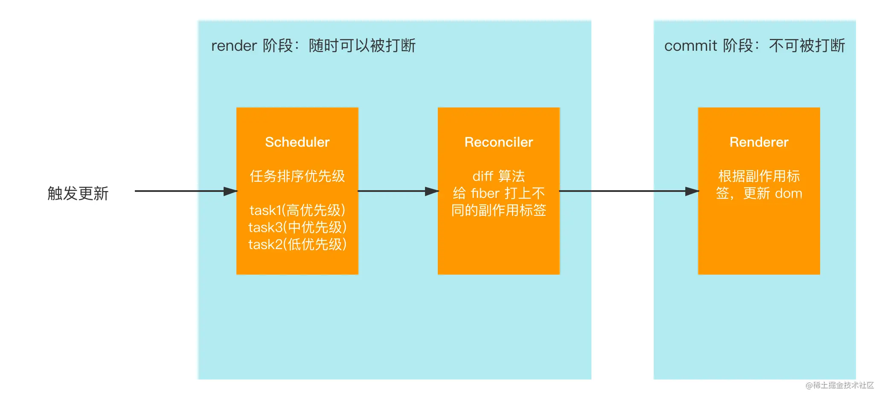

# 大体渲染过程

变量在更改时，页面如何更新渲染。

react为了保证页面能够流畅渲染，react16之后的更新过程分为render和commit两个阶段。render阶段包括scheduler（调度器）和Reconciler（协调器），commit 阶段包括 Renderer(渲染器)：

## 触发更新

主要有以下几种：reactDOM.render() setState, forUpdate, hooks 的useState，以及ref的改变，都会引起

## scheduler

当首次渲染或组建状态发生变更时，此时页面就要发生渲染了，scheduler过程会对诸多任务进行优先级排序，让浏览器的每一帧优先执行高优先级的任务（例如动画，），从而防止react的更新任务太大影响到用户交互，保证了页面的流畅性。

## reconciler

reconciler过程中，会开始根据优先级更新任务，这一过程主要根据最新状态构建新的fiber树，与之前的fiber树进行diff对比，对fiber的节点标记不同的副作用。对应渲染过程中真实dom的增删改。

## commmit

在render阶段，最终会生成一个effectList数组，记录了页面真实dom的新增，删除等以及一些事件响应，commit 会根据 effectList 对真实的页面进行更新，从而实现页面的改变