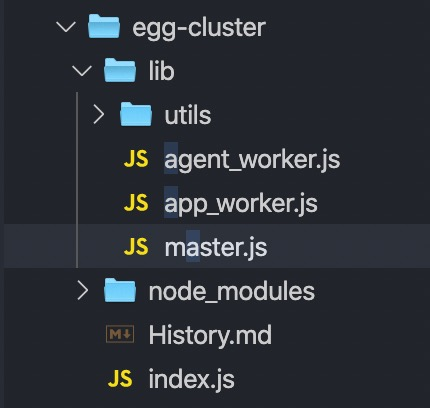

// 见云笔记

我们知道，egg框架的启动时序：

+ Master 启动后先 fork Agent 进程

+ Agent 初始化成功后，通过 IPC 通道通知 Master

+ Master 再 fork 多个 App Worker

+ App Worker 初始化成功，通知 Master

+ 所有的进程初始化成功后，Master 通知 Agent 和 Worker 应用启动成功

而我们关心的启动服务发生在appwork的时候。egg-cluster的项目结构：



其中关键的文件有：master.js, app_work.js, agent_work.js。master是跟nodejs的多进程有关，agent_work是agent进程，这里先行跳过，直接看app_work .js

```js
  // app_work.js
  const Application = require(options.framework).Application;
  const app = new Application(options);
  app.ready(startServer);

  function startServer(err) {
    if (err) {
      consoleLogger.error(err);
      consoleLogger.error('[app_worker] start error, exiting with code:1');
      exitProcess();
      return;
    }

    let server;

    // https config
    if (httpsOptions.key && httpsOptions.cert) {
      httpsOptions.key = fs.readFileSync(httpsOptions.key);
      httpsOptions.cert = fs.readFileSync(httpsOptions.cert);
      httpsOptions.ca = httpsOptions.ca && fs.readFileSync(httpsOptions.ca);
      server = require('https').createServer(httpsOptions, app.callback());
    } else {
      server = require('http').createServer(app.callback());
    }

    server.once('error', err => {
      consoleLogger.error('[app_worker] server got error: %s, code: %s', err.message, err.code);
      exitProcess();
    });

    // emit `server` event in app
    app.emit('server', server);
    
    if (options.sticky) {
      server.listen(options.stickyWorkerPort, '127.0.0.1');
      // Listen to messages sent from the master. Ignore everything else.
      process.on('message', (message, connection) => {
        if (message !== 'sticky-session:connection') {
          return;
        }

        // Emulate a connection event on the server by emitting the
        // event with the connection the master sent us.
        server.emit('connection', connection);
        connection.resume();
      });
    } else {
      if (listenConfig.path) {
        server.listen(listenConfig.path);
      } else {
        if (typeof port !== 'number') {
          consoleLogger.error('[app_worker] port should be number, but got %s(%s)', port, typeof port);
          exitProcess();
          return;
        }
        const args = [ port ];
        if (listenConfig.hostname) args.push(listenConfig.hostname);
        debug('listen options %s', args);
        server.listen(...args);
      }
    }
  }
```

代码中 options.framework 就是egg包，所以逻辑非常清晰：

1. 引入egg的Application类，

2. 拿一些参数做实例化，

3. 调用实例方法ready。 并将方法startServer作为回调方法传入。

startServer

可以看到，在startServer 方法中最后都会走一个 require('https').createServer() 启动一个node服务。当然方法中做了很多别的事情，这个留作后续分析。

现在 问题1，算是解决了。但是new Application时发生了什么呢，
