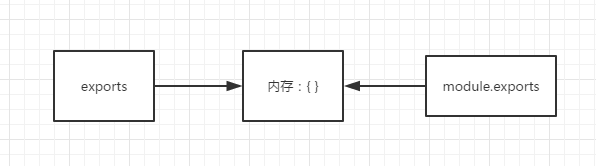

# node 模块

Node里面的模块系统遵循的是CommonJS规范。

```js
CommonJS定义的模块分为: 模块标识(module)、模块定义(exports) 、模块引用(require)
```

 先解释 exports 和 module.exports

在一个node执行一个文件时，会给这个文件内生成一个 exports和module对象，

而module又有一个exports属性。他们之间的关系如下图，都指向一块{}内存区域。

```js
exports = module.exports = {};
```



```js
//utils.js
let a = 100;

console.log(module.exports); //能打印出结果为：{}
console.log(exports); //能打印出结果为：{}
console.log(exports === module.exports); // true

exports.a = 200; //这里辛苦劳作帮 module.exports 的内容给改成 {a : 200}

exports = '指向其他内存区'; //这里把exports的指向指走


//test.js
var a = require('/utils');
console.log(a) // 打印为 {a : 200} 
```

用白话讲就是，exports只辅助module.exports操作内存中的数据，辛辛苦苦各种操作数据完，累得要死，结果到最后真正被require出去的内容还是module.exports的，真是好苦逼啊。
