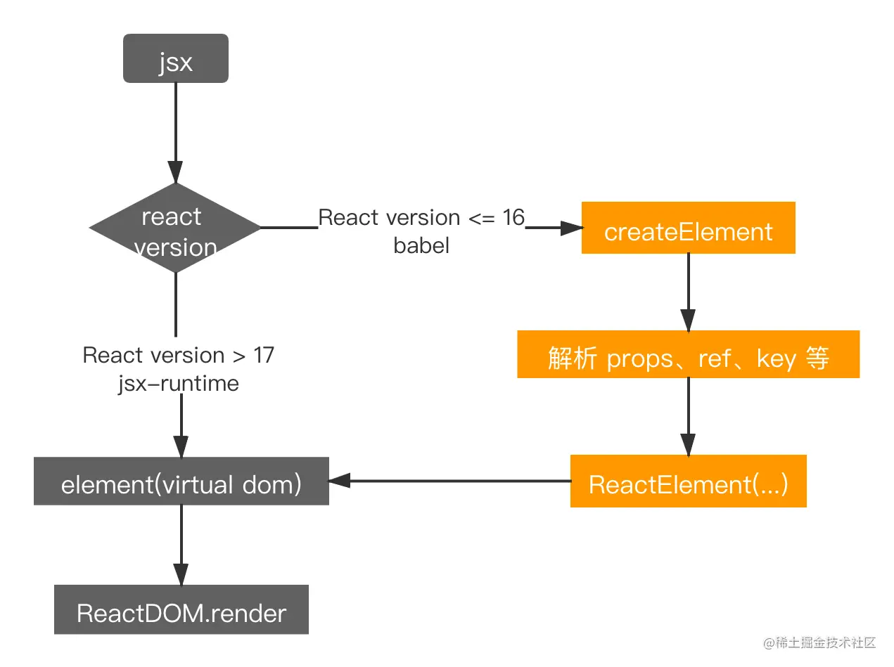

# 创建元素
```js
/**
 * Create and return a new ReactElement of the given type.
 * See https://reactjs.org/docs/react-api.html#createelement
 */
export function createElement(type, config, children) {
  let propName;

  // Reserved names are extracted
  const props = {};

  let key = null;
  let ref = null;
  let self = null;
  let source = null;

  if (config != null) {
    if (hasValidRef(config)) {
      ref = config.ref;
    }
    if (hasValidKey(config)) {
      key = '' + config.key;
    }

    self = config.__self === undefined ? null : config.__self;
    source = config.__source === undefined ? null : config.__source;
    // Remaining properties are added to a new props object
    for (propName in config) {
      if (
        hasOwnProperty.call(config, propName) &&
        !RESERVED_PROPS.hasOwnProperty(propName)
      ) {
        props[propName] = config[propName];
      }
    }
  }

  // Children can be more than one argument, and those are transferred onto
  // the newly allocated props object.
  const childrenLength = arguments.length - 2;
  if (childrenLength === 1) {
    props.children = children;
  } else if (childrenLength > 1) {
    const childArray = Array(childrenLength);
    for (let i = 0; i < childrenLength; i++) {
      childArray[i] = arguments[i + 2];
    }

    props.children = childArray;
  }

  // Resolve default props
  if (type && type.defaultProps) {
    const defaultProps = type.defaultProps;
    for (propName in defaultProps) {
      if (props[propName] === undefined) {
        props[propName] = defaultProps[propName];
      }
    }
  }

  return ReactElement(
    type,
    key,
    ref,
    self,
    source,
    ReactCurrentOwner.current,
    props,
  );
}
```

createElement 函数接收3个（以上）参数，（type, config, children）

比如有写法：

```js
const element0 = (
  <h1>Hello, world!</h1>
)


const element = (
  <h1 className="a">Hello, world!
    <span>123<span>
    <span>234</span>
  </h1>
)
```

```js
export default function App() {
  return React.createElement('h1', null, 'Hello world');
}

export default function App2() {
  return element = React.createElement("h1", {
      className: "a"
    },
    "Hello, world!",
    React.createElement("span", null, "123"),
    React.createElement("span", null, "234")
  );
}
```

## 参数说明：

React.createElement 其接收三个或以上参数：

1. type：要创建的 React 元素类型，可以是标签名称字符串，如 'div' 或者 'span' 等；也可以是 React组件 类型(class组件或者函数组件)；或者是 React fragment 类型。

2. config：写在标签上的属性的集合，js 对象格式，若标签上未添加任何属性则为 null。

3. children：从第三个参数开始后的参数为当前创建的React元素的子节点，每个参数的类型，若是当前元素节点的 textContent 则为字符串类型；否则为新的 React.createElement 创建的元素。

## 执行过程：

由代码可知，React.createElement 做的事情主要有：

解析 config 参数中是否有合法的 key、ref、__source 和 __self 属性，若存在分别赋值给 key、ref、source 和 self；将剩余的属性解析挂载到 props 上

除 type 和 config 外后面的参数，挂载到 props.children 上
针对类组件，如果 type.defaultProps 存在，遍历 type.defaultProps 的属性，如果 props 不存在该属性，则添加到 props 上

将 type、key、ref、self、props 等信息，调用 ReactElement 函数**创建虚拟 dom**，


